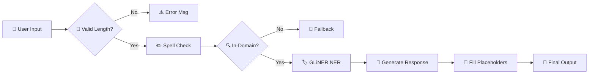

Here is a visually optimized, cleaner, and more attractive version of your README. It uses collapsible sections to keep the length manageable while preserving all technical depth, and it uses formatting tricks to make the content pop.

```markdown
# 🎫 Advanced Event Ticketing Customer Support Chatbot

<div align="center">


**🚀 An intelligent, domain-specific chatbot powered by fine-tuned transformers.**

Featuring advanced NER, spell correction, and seamless event ticketing support.

[**Live Demo**](https://advanced-event-ticketing-customer-support-chatbot.streamlit.app/) • [**DistilGPT2 Model**](https://huggingface.co/IamPradeep/AETCSCB_OOD_IC_DistilGPT2_Fine-tuned) • [**Classifier Model**](https://huggingface.co/IamPradeep/Query_Classifier_DistilBERT)


</div>

---

## 📖 Table of Contents
- [✨ Highlights](#-highlights)
- [🏗️ Architecture](#️-architecture)
- [🤖 Model Stack](#-model-stack)
- [📊 Performance](#-performance)
- [🚀 Quick Start](#-quick-start)
- [📂 Project Structure](#-project-structure)
- [📜 License](#-license)

---

## ✨ Highlights

<table>
<tr>
<td width="50%">

**🧠 Smart Classification**
- DistilBERT-based OOD detection.
- 99.96% accuracy on validation.
- Graceful handling of off-topic queries.

</td>
<td width="50%">

**💬 Contextual Responses**
- Fine-tuned DistilGPT2 for ticketing.
- Streaming text generation.
- Professional, domain-aware replies.

</td>
</tr>
<tr>
<td width="50%">

**🏷️ Zero-Shot Entity Extraction**
- GLiNER for dynamic entity recognition.
- Detects events, cities, venues instantly.
- Auto-fills response placeholders.

</td>
<td width="50%">

**🛡️ Robust Input Processing**
- Length validation (max 128 tokens).
- T5-based spell correction.
- Efficient resource management.

</td>
</tr>
</table>

---

## 🏗️ Architecture

The system follows a strict pipeline to ensure efficiency and accuracy.



### Pipeline Logic
1. **Validation:** Checks length immediately to save compute.
2. **Correction:** Fixes typos only if the query is valid.
3. **Classification:** Determines if the query is relevant.
4. **NER:** Extracts key entities (Event, City) for personalization.
5. **Generation:** Creates a coherent response based on the context.

---

## 🤖 Model Stack

<details>
<summary><b>1️⃣ Response Generator: DistilGPT2</b> <i>(Fine-tuned)</i></summary>

**Purpose:** Generates domain-specific natural language responses.

*   **Base Model:** `distilgpt2`
*   **Training Data:** 30,766 instruction-response pairs
*   **Key Params:** Temp=0.5, Top_P=0.95, Max Length=256

| Epoch | Loss |
|-------|------|
| 1 | 0.38 |
| 5 | 0.13 |
| 10 | 0.08 |
</details>

<details>
<summary><b>2️⃣ Query Classifier: DistilBERT</b> <i>(Fine-tuned)</i></summary>

**Purpose:** Binary classification to separate In-Domain vs Out-of-Domain queries.

*   **Base Model:** `distilbert-base-uncased`
*   **Accuracy:** **99.96%**
*   **Labels:** In-Domain (0), Out-of-Domain (1)

</details>

<details>
<summary><b>3️⃣ Entity Extractor: GLiNER</b></summary>

**Purpose:** Zero-shot Named Entity Recognition for dynamic data extraction.

*   **Model:** `gliner-community/gliner_small-v2.5`
*   **Labels:** `["event", "city", "location", "venue"]`
*   **Threshold:** 0.4 Confidence

</details>

<details>
<summary><b>4️⃣ Spell Corrector: T5</b></summary>

**Purpose:** Preprocesses user input to handle typos and misspellings.

*   **Model:** `oliverguhr/spelling-correction-english-base`
*   **Example:** "cancle my tiket" → "cancel my ticket"
</details>

---

## 📊 Performance

### Classification Metrics
<div align="center">

| Metric | Score |
|--------|-------|
| **Accuracy** | 99.96% |
| **F1-Score** | 99.96% |
| **Precision** | 99.95% |
| **Recall** | 99.98% |

</div>

### Training Progress (DistilGPT2)
```
Epoch 1  ████████████████████████▏ 0.3828
Epoch 5  ███████████████████▊      0.1367
Epoch 10 ██████████▌               0.0864
```

---

## 🚀 Quick Start

### Installation

```bash
# Clone repo
git clone https://github.com/MarpakaPradeepSai/Advanced-Event-Ticketing-Chatbot.git
cd Advanced-Event-Ticketing-Chatbot

# Setup environment
python -m venv venv
source venv/bin/activate  # Windows: venv\Scripts\activate

# Install deps
pip install -r requirements.txt

# Run
streamlit run app.py
```

### Dependencies
```txt
streamlit>=1.52.2
gliner>=0.2.7
torch
transformers>=4.30.0
sentencepiece
```

### Usage Example

```python
from transformers import pipeline
from gliner import GLiNER

# 1. Load Models
ner_model = GLiNER.from_pretrained("gliner-community/gliner_small-v2.5")
spell_pipe = pipeline("text2text-generation", model="oliverguhr/spelling-correction-english-base")

# 2. Process Query
query = "How can I get a refund for the Coldplay concert in London?"

# Correct Spelling
corrected = spell_pipe(query)[0]['generated_text']

# Extract Entities
entities = ner_model.predict_entities(corrected, labels=["event", "city"], threshold=0.4)

# Result: {'event': 'Coldplay concert', 'city': 'London'}
```

---

## 📂 Project Structure

```
.
├── 📂 models/                # Fine-tuned model weights
│   ├── distilgpt2_finetuned/
│   └── distilbert_classifier/
├── 📂 notebooks/             # Jupyter training logs
├── 📂 src/                   # Core logic modules
│   ├── model_loader.py
│   ├── response_generator.py
│   ├── spell_corrector.py
│   └── ner_processor.py
├── 📂 data/                  # Raw & Processed data
├── app.py                    # Streamlit Entry point
└── requirements.txt
```

---

## 🔮 Future Enhancements

- [ ] 🌍 **Multi-lingual Support**
- [ ] 🗣️ **Voice Input Integration**
- [ ] 📱 **Mobile-First UI**
- [ ] 🔌 **Live Ticketing API Integration**

---

## 📜 License & Acknowledgments

<div align="center">

This project is licensed under the **MIT License**.

Special thanks to:
[Hugging Face](https://huggingface.co/) • [Streamlit](https://streamlit.io/) • [GLiNER](https://github.com/urchade/GLiNER)

<br>

**Built with ❤️ by [Marpaka Pradeep Sai](https://github.com/MarpakaPradeepSai)**

[⭐ Star us on GitHub!](https://github.com/MarpakaPradeepSai/Advanced-Event-Ticketing-Chatbot)

</div>
```
